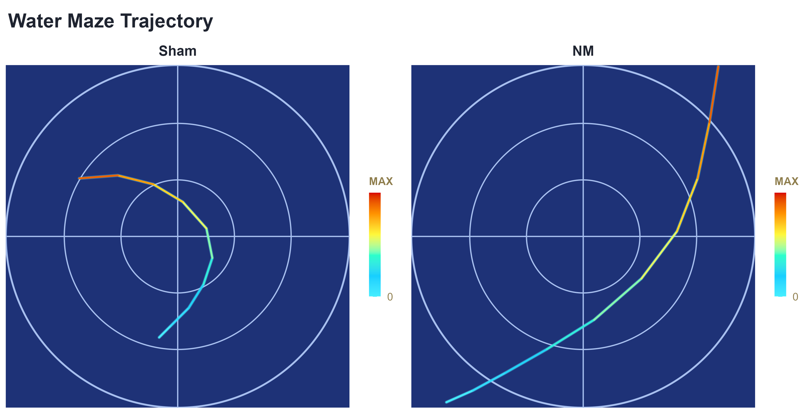
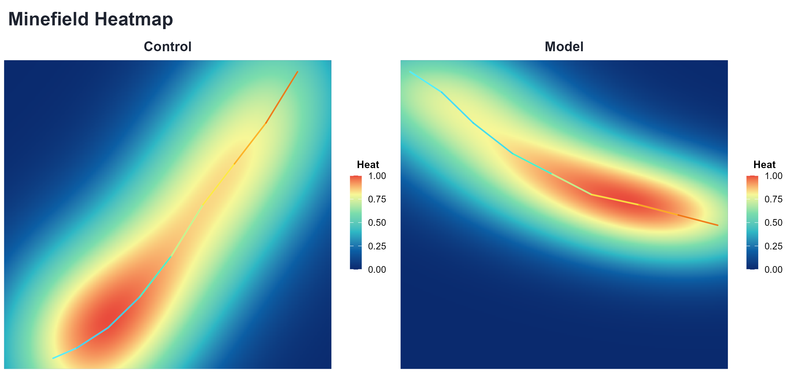

# MMV

R-first toolkit for automatic visualization of **water maze** and **minefield** trajectory tasks.

MMV focuses on:
- a unified CSV schema
- explicit legacy-to-standard CSV conversion
- two direct plotting functions
- `thisplot`-style theme integration with builtin fallback

## Visual Preview

| Water Maze | Minefield |
|---|---|
|  |  |

## Install

```r
install.packages("remotes")
remotes::install_github("hurry060215-tech/MMV")
library(MMV)
```

Optional dependencies:
```r
install.packages(c("ggplot2", "dplyr", "cowplot", "testthat"))
install.packages(c("reticulate", "yaml"))
```

## Quick Demo (Copy and Run)

```r
wm_csv <- system.file("templates", "watermaze_template.csv", package = "MMV")
mf_csv <- system.file("templates", "minefield_template.csv", package = "MMV")

# 1) Convert to standard schema (recommended)
cnv <- convert_mmviz_csv(
  path = wm_csv,
  out_path = "outputs/watermaze_template_standard.csv",
  task = "watermaze",
  overwrite = TRUE
)

# 2) Water maze (line-gradient trajectory, non-gradient background)
plot_watermaze(
  cnv$output_file,
  cfg = list(
    style_mode = "thisplot",
    plot_mode = "line_gradient",
    out_file = "outputs/watermaze_demo.png"
  )
)

# 3) Minefield (heatmap + optional trajectory overlay)
plot_minefield(
  mf_csv,
  cfg = list(
    style_mode = "thisplot",
    overlay_trajectory = TRUE,
    out_file = "outputs/minefield_demo.png"
  )
)
```

Development-mode example script:
```r
source("inst/examples/example_usage.R")
```

Helper scripts:
- `inst/examples/example_usage.R`: minimal end-to-end example.
- `scripts/run_examples.R`: template conversion + watermaze + minefield + batch.

## Regenerate README Example Figures

```r
source("scripts/build_readme_examples.R")
```

This script writes:
- `inst/examples/figures/watermaze_demo.png`
- `inst/examples/figures/minefield_demo.png`

## Input Schema

Required columns:
- `subject_id`
- `group`
- `trial_id`
- `frame`
- `x`
- `y`

Optional columns:
- `time_sec`
- `event`

Legacy coordinate-stream CSV is also supported (for example: `"233,135","233,135",...`).

## Main Functions

- `convert_mmviz_csv(path, out_path = NULL, task = "watermaze", overwrite = FALSE)`
- `convert_mmviz_folder(input_dir, out_dir, task = "watermaze", ...)`
- `plot_watermaze(input, cfg = list())`
- `plot_minefield(input, cfg = list())`
- `plot_batch(manifest, out_dir, cfg = list())`

## Style Modes

- `style_mode = "thisplot"`: use `thisplot::theme_this()` and `thisplot::palette_colors()` when available.
- `style_mode = "builtin"`: internal fallback palette/theme.

Default is `thisplot` with automatic fallback.

## GitHub Publish Helper

```powershell
powershell -ExecutionPolicy Bypass -File scripts/publish_mmv_github.ps1
```

## pkgdown Setup

`pkgdown` is not automatic by GitHub itself. This repo includes:
- `_pkgdown.yml`
- `.github/workflows/pkgdown.yaml`

Before first deployment:
1. Replace `YOUR_GITHUB_USERNAME` in `_pkgdown.yml`.
2. Push to `main`.
3. In GitHub repository settings, enable Pages from `gh-pages`.
