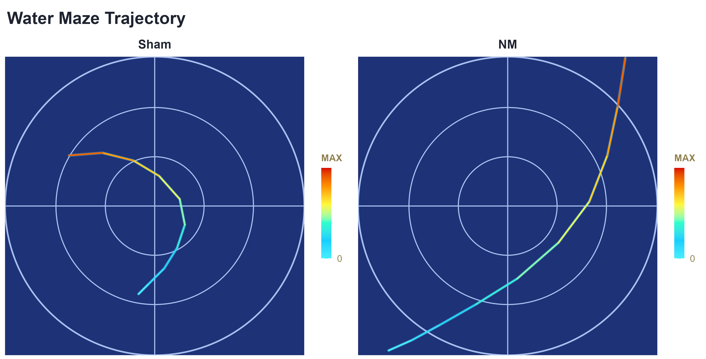
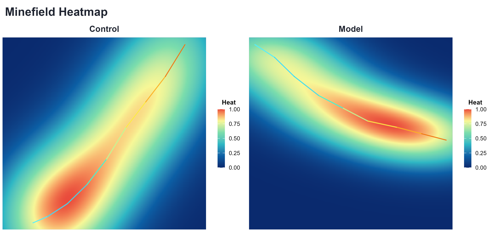
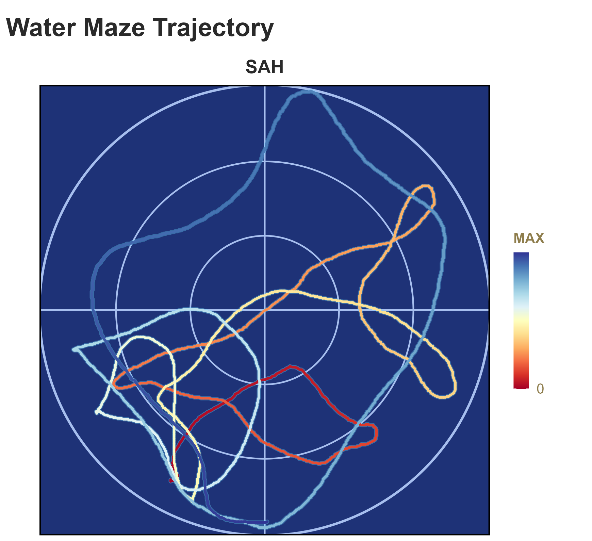
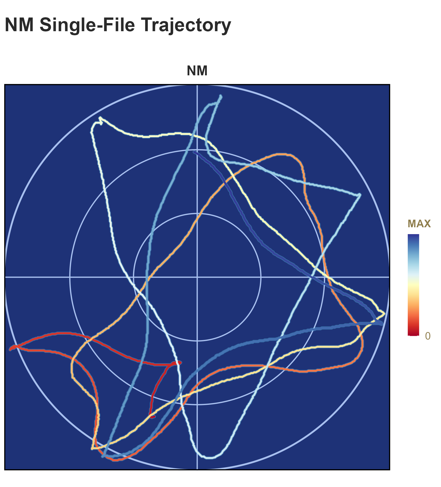

# MMV

[](LICENSE.md)
[](https://github.com/hurry060215-tech/MMV/actions/workflows/R-CMD-check.yaml)
[](https://hurry060215-tech.github.io/MMV/)

R-first toolkit for automatic visualization of **water maze** and **minefield** trajectory tasks.

MMV focuses on:
- a unified CSV schema
- explicit legacy-to-standard CSV conversion
- two direct plotting functions
- `thisplot`-style theme integration with builtin fallback

## Visual Preview

| Water Maze | Minefield |
|---|---|
|  |  |

Real legacy-file examples (your raw coordinate style):

| SAH (Legacy CSV) | NM (Legacy CSV) |
|---|---|
|  |  |

## Install

```r
install.packages("remotes")
remotes::install_github("hurry060215-tech/MMV")
library(MMV)
```

Optional dependencies:
```r
install.packages(c("yaml", "reticulate"))
# thisplot is optional; MMV automatically falls back to its builtin theme.
```

## Quick Demo (Copy and Run)

```r
library(MMV)

# Easiest first run: create data templates, a manifest, and a runner.
mmviz_init("my-mmv-project")
# Then run: Rscript my-mmv-project/run_mmviz.R

wm_csv <- system.file("templates", "watermaze_template.csv", package = "MMV")
mf_csv <- system.file("templates", "minefield_template.csv", package = "MMV")

# 1) Read and plot immediately
plot_mmviz(
  wm_csv,
  task = "watermaze",
  cfg = list(
    style_mode = "builtin",
    out_file = "outputs/watermaze_demo.png"
  )
)

# 2) Convert to the standard schema when you want a reusable clean CSV
cnv <- convert_mmviz_csv(
  path = wm_csv,
  out_path = "outputs/watermaze_template_standard.csv",
  task = "watermaze",
  overwrite = TRUE
)

# 3) Plot the converted file
plot_watermaze(
  cnv$output_file,
  cfg = list(
    style_mode = "builtin",
    plot_mode = "line_gradient",
    out_file = "outputs/watermaze_demo.png"
  )
)

# 4) Minefield (heatmap + optional trajectory overlay)
plot_minefield(
  mf_csv,
  cfg = list(
    style_mode = "builtin",
    overlay_trajectory = TRUE,
    out_file = "outputs/minefield_demo.png"
  )
)
```

Run the installed end-to-end example:
```r
source(system.file("examples", "example_usage.R", package = "MMV"))
```

Repository contributors can run `source("scripts/run_examples.R")` for template
conversion, water-maze, minefield, and batch examples from a source checkout.

## Regenerate README Example Figures

```r
source("scripts/build_readme_examples.R")
```

This script writes:
- `man/figures/watermaze_demo.png`
- `man/figures/minefield_demo.png`

## Input Schema

Required columns:
- `subject_id`
- `group`
- `trial_id`
- `frame`
- `x`
- `y`

Optional columns:
- `time_sec`
- `event`

Legacy coordinate-stream CSV is also supported as quoted coordinate pairs (for
example, `"233,135","233,135",...`) or a headerless two-column numeric CSV.
Signed, decimal, and scientific-notation coordinates are accepted.

## Batch Manifests

A CSV or YAML manifest needs `task` and `input` fields. Relative input paths are
resolved from the manifest file's directory. Every row returns an `ok` or
`error` status, so one bad file does not stop the remaining jobs.

```r
manifest <- system.file("templates", "manifest_template.csv", package = "MMV")
result <- plot_batch(manifest, out_dir = "outputs/batch")
print(result)
```

## Main Functions

- `mmviz_init(path = "MMV-project")`
- `plot_mmviz(input, task, cfg = list(), out_file = NULL)`
- `convert_mmviz_csv(path, out_path = NULL, task = "watermaze", overwrite = FALSE)`
- `convert_mmviz_folder(input_dir, out_dir, task = "watermaze", ...)`
- `plot_watermaze(input, cfg = list())`
- `plot_minefield(input, cfg = list())`
- `plot_batch(manifest, out_dir, cfg = list())`

## Style Modes

- `style_mode = "thisplot"`: use `thisplot::theme_this()` and `thisplot::palette_colors()` when available.
- `style_mode = "builtin"`: internal fallback palette/theme.

Default is `thisplot` with automatic fallback.

## Optional Python Hook

The Python post-processing hook is disabled by default and remains
**experimental**. It requires an external module implementing
`postprocess_track(data, task)` or `postprocess(data, task)`. Pure-R plotting is
the supported default; follow [issue #5](https://github.com/hurry060215-tech/MMV/issues/5)
for the versioned backend contract before relying on it in production.

## License

MMV is released under the MIT License. See [`LICENSE.md`](LICENSE.md) for the
full license text.

## GitHub Publish Helper

```powershell
powershell -ExecutionPolicy Bypass -File scripts/publish_mmv_github.ps1
```

If your current folder has git lock/permission issues, use the temp-path publisher:
```powershell
powershell -ExecutionPolicy Bypass -File scripts/publish_mmv_from_temp.ps1
```

## pkgdown Setup

`pkgdown` is not automatic by GitHub itself. This repo includes:
- `_pkgdown.yml`
- `.github/workflows/pkgdown.yaml`

The workflow regenerates documentation and deploys `main` to the `gh-pages`
branch. GitHub Pages must use that branch in the repository settings.
